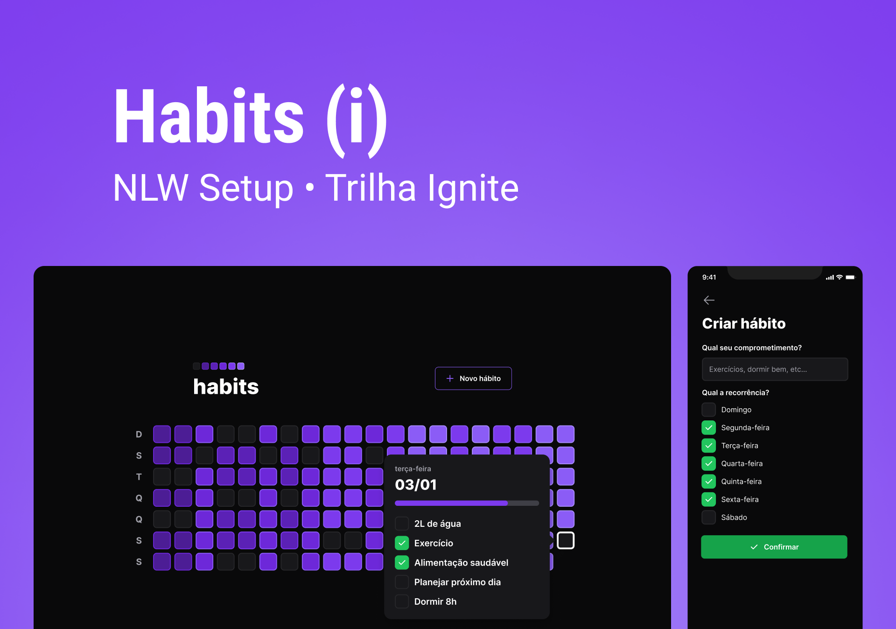

<h1 align="center"> Habits </h1>

  

O Habits é um aplicativo para ajudar o usuário a rastrear hábitos diários (tarefas diárias).

## :rocket: Tecnologias

  - ReactJS;
  - React Native;
  - Node.JS;
  - Prisma;
  - Fastify;
  - Tailwindcss;
  - NativeWind - Tailwindcss para React Native;
  - Vite;
  - Typescript;
---

## :computer: Projeto

  - Back-end:
  - Front-end:
  - Mobile: 
---

## 🔖 Projeto

Visualizar o layout do projeto através do [LINK](https://www.figma.com/file/LV06lW0RPNPoV39LRoCEc7/nlw-setup%3A-Habits?node-id=6%3A344&t=RX7YxUcVVysUZn97-1). É necessário ter uma conta no [figma](https://www.figma.com/) para acessar o layout do projeto.

---

Feito com ♥ by Iann Rodrigues

